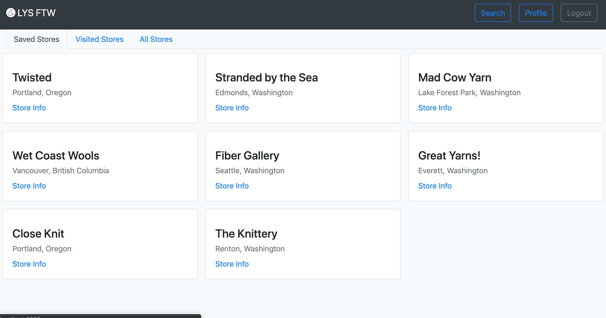

# LYS Finder

Search your neighborhood for local yarn stores!

Check it out [here](https://frozen-badlands-61852.herokuapp.com/)!


## Resources

### APIS
- [Ravelry API](https://www.ravelry.com/api)
- [Mapbox GL JS](https://docs.mapbox.com/mapbox-gl-js/api/)

### Libraries Used
- NodeJS
- Express
- Bootstrap

### Dependencies
Mapbox, Axios, Postgres, Sequelize...
For a complete list, please see the package.json. 

### Additional Resources
- [Font Awesome](https://fontawesome.com/) for nearly all icons.
- [Flat Icon](https://www.flaticon.com/) and [smalllikeart]("https://www.flaticon.com/authors/smalllikeart" title="smalllikeart") for the yarn ball icon used on the map.
- [stackoverflow](https://stackoverflow.com/)

## Design

I started with a general idea of what I wanted to create: a search page and a general information page for each page.
#### Search Page with Map


#### Store Information Page


## Planning

### Models
The next thing that I focused on was what sort of data I'd want to save and what would be better to call from the API I decided to use. Looking at the information I got back from the API, I didn't need to save a ton of that information to my databases; it would be better to leave things like addresses out and call the API when I needed them.


### Routes
I planned these out after I knew what my models and API data would be.

|METHOD| ROUTE| FUNCTION|
|:-----|:----:|:------:|
| GET   | `/` | `general search page` |
| GET   | `/auth/signup` | `render sign-in page` |
| GET   | `/auth/login` | `render login page` |
| GET   | `/auth/logout` | `deletes the session and logs out` |
| POST  | `/auth/signup` | `accepts data and checks in` |
| POST  | `/auth/login` | `accepts data and checks authentication` |
| GET   | `/search` | `finds search results and renders map (calls API)` |
| GET   | `/search/:id` | `renders individual store data (calls API)` |
| GET   | `/profile` | `finds stores saved by user and renders them` |
| GET   | `/profile/:id` | `renders one saved store and accompanying notes (calls API)` |
| POST  | `/profile/add/:id` | `add selected store to the user's saved stores` |
| POST  | `/profile/:id/notes` | `post a note to a saved store` |
| PUT   | `/profile/:id/update` | `mark a store as "visited"` |
| DELETE| `/profile/:id` | `remove store from user's saved stores` |

## Thoughts

- I definitely thought I would need more views than I did. I made more than I needed and then pared down once the routes were functional, making sure that if I changed a page I changed the route to render or redirect to the right place.

- clickable points on the map was the most difficult thing to achieve. I looked through the documentation for the Mapbox API, but the parts that I needed to know ended up being in two separate examples in the documentation that needed to be cobbled together.

- JOIN TABLES were not my friend (at first). I chose to link comments by the primary key from my join table (usersLocations). In Sequelize, when you get information directly from a join table it does not send the primary key, so it couldn't find any comments. The first solution was to copy the id information from the migration into the model for my usersLocations table. That allowed me to access the primary key. Then it blew up again. Sequelize turns all model names singular when referencing a primary key, so it turned every "usersLocationsId" into "usersLocationId". The easiest solution was to make a new table with a singular name, include the id information in the model, and try again. Thus, usersLocations became favorites! Suddenly, my route worked! Huzzah!

```js
router.get('/:id', function (req, res) {
    let ravId = parseInt(req.params.id)
    let apiUrl = 'https://api.ravelry.com/shops/' + ravId + '.json?include=schedules'
    let headers = {
        'Authorization': 'Basic ' + Buffer.from(`${process.env.APIUSER}:${process.env.APIPASS}`).toString('base64')
    };

    db.location.findOne({
        where: {ravId: ravId}
    }).then( function (location) {
        db.favorite.findOne({
            where: {
                locationId: location.id,
                userId: req.user.id
            }
        }).then(function (favorite) {
            db.comment.findAll({
                where: {
                    favoriteId: favorite.id
                }
            }).then( function (comments) {
                axios.get(apiUrl, {headers} ).then( function(response) {
                    let shopData = response.data
                    res.render('profile/show', { shopData, comments, favorite })
                });
            });
        });
    });
});
```

## Known Problems
- depending on the notes_html coming from the API, there are occasionally broken images that are not being rendered into the page correctly. They're using relative paths to render them on Ravelry, but they won't work on another site.
- errors on locations outside the US.

## Future Additions/Edits
- [ ] make it more responsive!
- [ ] if no user is logged in, the favorite button is invisible when the search page renders
- [ ] display brands recently purchased at the store
- [ ] display specific hours the store is open, if information is available
- [ ] complete map of all stores saved by user
- [ ] ability for user to edit their own profile (name, email, change password...)
- [ ] review system to prioritize better stores on the list
- [ ] add ability to search saved places by location

## Additional Screenshots

### Map Popup

### Store View from Search

### Profile View

### Store View from Profile

